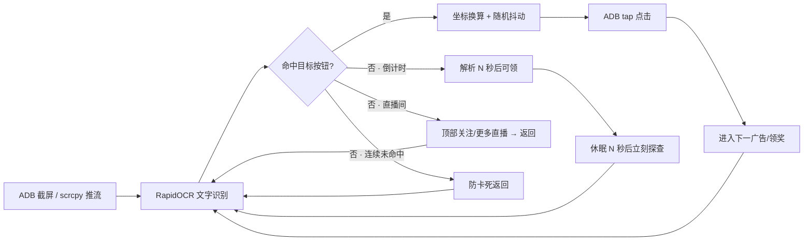

<div align="center">

# 🥤 汽水音乐 · 自动看广告

**ADB + OCR 驱动的「看广告领时长」自动化助手**

一键识别领取按钮 · 倒计时智能等待 · 直播间秒退 · 防检测点击抖动

[](https://www.python.org/)
[]()
[](LICENSE)
[](https://opencv.org/)
[](https://github.com/RapidAI/RapidOCR)
[](https://github.com/52mfan/qishui-ad-auto/stargazers)

[功能特性](#-功能特性) ·
[快速开始](#-快速开始) ·
[工作原理](#-工作原理) ·
[使用教程](#-详细文档) ·
[常见问题](#-常见问题) ·
[免责声明](#-免责声明)

</div>

---

## ✨ 一句话

> 打开汽水音乐「看广告领时长」页面后，本工具用 **OCR 识别屏幕**，自动点击  
> **领取奖励 / 继续观看 / 领取成功**，并处理倒计时、直播间误入、卡死等情况，  
> 让挂机更省心、更像真人。

---

## 🎯 功能特性

<table>
<tr>
<td width="50%" valign="top">

### 🧠 智能识别
- **OCR 按钮识别** — RapidOCR 中文识别，置信度可调
- **倒计时解析** — 「14秒后可领奖励」→ 精确等待后再点击
- **防误点** — 倒计时文案、解说词不会被当成按钮
- **模糊匹配** — 容忍 OCR 错字、缺字、尾部符号

</td>
<td width="50%" valign="top">

### ⚡ 稳定挂机
- **直播间秒退** — 顶部「关注 / 更多直播」立即返回
- **防卡死兜底** — 连续未命中自动返回，广告中不误触
- **坐标自适应** — 影像分辨率 ≠ 真机时自动换算
- **点击抖动** — 坐标 ±6px、间隔随机，降低脚本特征

</td>
</tr>
<tr>
<td width="50%" valign="top">

### 🖥️ 现代 GUI
- 实时手机画面预览（scrcpy 约 30 FPS）
- OCR 命中框可视化 · 识别信息表
- 手机状态：机型 / 电量 / 充电 / 网络 / IP
- WiFi ADB 无线连接 · 熄屏运行

</td>
<td width="50%" valign="top">

### 🛠️ 工程友好
- GUI / CLI 双形态，可打单文件 EXE
- 详细中文文档（手机设置 → 环境 → 使用 → 打包）
- MIT 开源协议 · 无账号体系 · 无遥测

</td>
</tr>
</table>

---

## 📸 界面一览

```
┌────────────────────────┬──────────────────────────┐
│                        │  手机信息                 │
│    实时影像预览         │  Xiaomi M2007J1SC         │
│    （scrcpy H.264）    │  Android 13 · 1080x2340   │
│                        │  电量 97% · 充电中        │
│    [领取奖励] ◉ 命中   │  WiFi · IP 192.168.x.x    │
│                        ├──────────────────────────┤
│                        │  重点识别                 │
│                        │  领取奖励   1.00  (542,1235) │
│                        │  继续观看   0.99  (892,134)  │
│                        ├──────────────────────────┤
│                        │  运行日志                 │
│                        │  🎯 点击「领取奖励」…     │
│                        │  ⏱ 广告倒计时 3s…         │
└────────────────────────┴──────────────────────────┘
```

---

## 🧩 工作原理



| 环节 | 技术 |
|------|------|
| 画面来源 | `adb screencap` / **scrcpy H.264**（命名管道 + PyAV） |
| 文字识别 | **RapidOCR**（PP-OCRv4 ONNX，本地推理） |
| 设备控制 | `adb shell input tap / keyevent` |
| 防检测 | 坐标抖动、时间间隔浮动、点击前微延迟 |

---

## 🚀 快速开始

### 0. 环境要求

| 项目 | 要求 |
|------|------|
| 手机 | Android 8+，已开 USB 调试（部分机型需「模拟点击」） |
| 电脑 | Windows 10+ / Linux / macOS |
| Python | 3.9 – 3.12 |
| adb | platform-tools（或放项目 `platform-tools/`） |
| 可选 | [scrcpy](https://github.com/Genymobile/scrcpy)（高帧率预览） |

### 1. 克隆项目

```bash
git clone https://github.com/52mfan/qishui-ad-auto.git
cd qishui-ad-auto
```

### 2. 安装依赖

```bash
pip install -r requirements.txt
```

国内可换源：

```bash
pip install -r requirements.txt -i https://pypi.tuna.tsinghua.edu.cn/simple
```

### 3. 手机开启调试

1. **设置 → 关于手机** → 连点 **版本号** 7 次  
2. **开发者选项** → 打开 **USB 调试**  
3. 小米 / vivo 等请再开 **USB 调试（安全设置）** / **允许模拟点击**  
4. 连接电脑，手机弹窗点 **允许**  
5. 验证：`adb devices` 显示 `device`

> 详细步骤见 [docs/01-手机设置.md](docs/01-手机设置.md)

### 4. 运行

```bash
# 图形界面（推荐）
python qishui_ad_gui.py

# 或命令行
python qishui_ad_bot.py
```

Windows 也可双击 `启动.bat`。

### 5. 开始挂机

1. 手机打开 **汽水音乐 → 看广告领时长** 页面  
2. 点 GUI **「启动」**（或等 CLI 开始识别）  
3. 看到日志 `🎯 点击「领取奖励」` 即成功  
4. 停止：GUI 点「停止」/ CLI 按 `Ctrl+C`

---

## 📚 详细文档

| 文档 | 内容 |
|------|------|
| [docs/01-手机设置.md](docs/01-手机设置.md) | 开发者选项、USB 调试、厂商差异 |
| [docs/02-电脑环境.md](docs/02-电脑环境.md) | Python、pip、adb、可选 scrcpy |
| [docs/03-使用教程.md](docs/03-使用教程.md) | GUI 区域说明、行为逻辑、排错 |
| [docs/04-打包EXE.md](docs/04-打包EXE.md) | PyInstaller 单文件打包与发布 |

---

## 📦 项目结构

```
qishui-ad-auto/
├── README.md                 # 本文件
├── LICENSE                   # MIT
├── requirements.txt
├── 启动.bat
├── qishui_ad_gui.py          # GUI 版（推荐）
├── qishui_ad_bot.py          # 命令行版
├── live_screen.py            # 实时影像（scrcpy / 截图回退）
└── docs/
    ├── 01-手机设置.md
    ├── 02-电脑环境.md
    ├── 03-使用教程.md
    └── 04-打包EXE.md
```

---

## ⚙️ 可配置项

源码顶部集中配置，开箱即用，也可自行微调：

| 配置 | 默认 | 说明 |
|------|------|------|
| `TARGETS` | 领取奖励… | 点击目标优先级 |
| `OCR_SCORE` | 0.55 | OCR 置信度下限 |
| `TARGET_ROI` | 中下区域 | 按钮允许出现范围 |
| `POLL_INTERVAL` | 1.2s | 识别轮询（±随机浮动） |
| `CLICK_JITTER` | 6px | 点击坐标随机抖动 |
| `MISS_BACK_THRESHOLD` | 6 | 连续未命中防卡死 |

---

## ❓ 常见问题

<details>
<summary><b>adb devices 是空的 / unauthorized？</b></summary>

- 换原装数据线，换 USB 口  
- 手机弹窗勾选「一律允许」  
- 小米需登录账号后打开「USB 调试（安全设置）」  
- 见 [docs/01-手机设置.md](docs/01-手机设置.md)

</details>

<details>
<summary><b>识别到了却不点击？</b></summary>

日志若出现 `拒绝: … 出界`，说明按钮不在 ROI 内。  
放宽 `qishui_ad_gui.py` 中 `TARGET_ROI` 的 `y` 范围（如 `0.10 ~ 0.98`）。

</details>

<details>
<summary><b>预览很卡 / 只有 1.5 FPS？</b></summary>

未使用 scrcpy 时为截图模式，约 1.5 FPS，**不影响点击**。  
安装 scrcpy 并放到程序同级 `scrcpy/` 目录后可达约 30 FPS。

</details>

<details>
<summary><b>会误点「14秒后可领奖励」吗？</b></summary>

不会。倒计时文案会被识别为**等待信号**，休眠对应秒数后再探查真正的「领取奖励」按钮。

</details>

<details>
<summary><b>如何打包成 EXE？</b></summary>

见 [docs/04-打包EXE.md](docs/04-打包EXE.md)。GUI 版用 `--windowed`，体积约 100MB+（含 OCR 模型）属正常。

</details>

---

## 🤝 贡献

欢迎 Issue / PR：

- 提高 OCR 准确率与 ROI 策略  
- 支持更多活动页面文案  
- 优化 scrcpy 流稳定性  
- 文档与打包体验改进

---

## ⚠️ 免责声明

本项目仅供 **学习、研究与个人自动化效率** 使用。  

- 请遵守目标应用的用户协议与当地法律法规  
- 不得用于破坏服务公平性、批量滥用或其他违规用途  
- 使用本软件产生的一切后果由使用者自行承担  
- 作者不对任何账号封禁、财产损失等负责  

**使用即表示你已阅读并同意上述声明。**

---

## 📄 License

[MIT License](LICENSE) © 2026 qishui-ad-auto contributors

---

<div align="center">

如果这个项目对你有帮助，欢迎点个 ⭐ Star 支持一下

</div>
