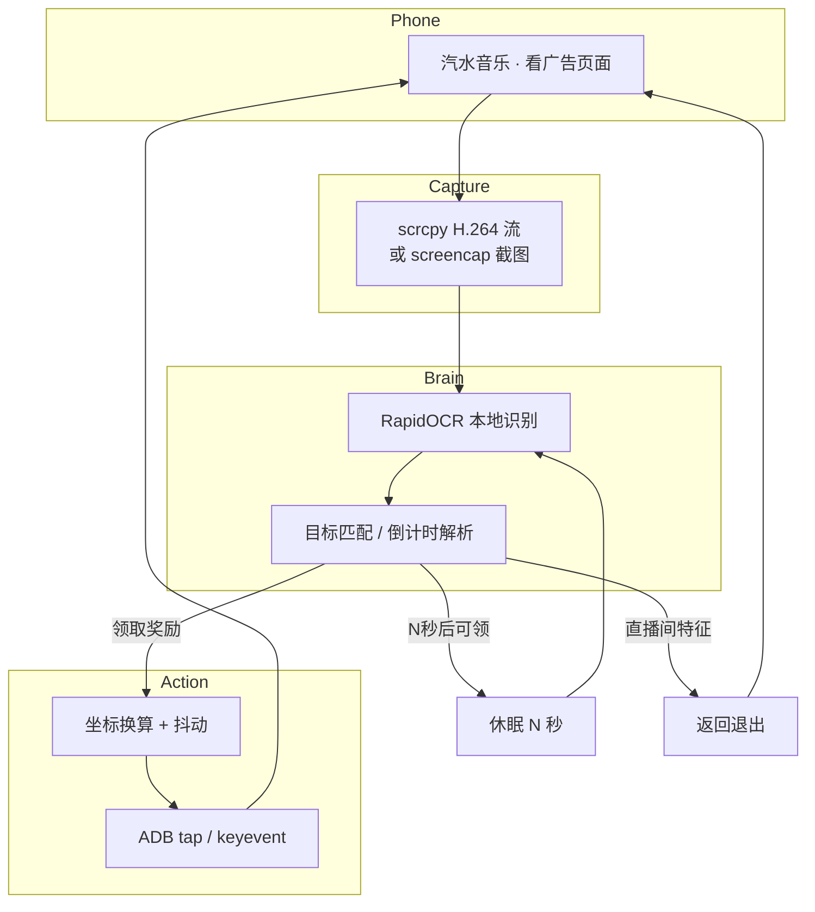

<div align="center">


### 汽水音乐 · 自动看广告

让「看广告领时长」这件事，交给脚本。

**识别 · 等待 · 点击 · 挂机** 一气呵成

<br />

[](https://python.org)
[](https://opencv.org)
[](https://github.com/RapidAI/RapidOCR)
[](LICENSE)
[]()

[](https://github.com/52mfan/qishui-ad-auto/stargazers)
[](https://github.com/52mfan/qishui-ad-auto/network/members)

**[`文档`](docs/) · [`快速开始`](#-quick-start) · [`特性`](#-features) · [`FAQ`](#-faq) · [`免责声明`](#-disclaimer)**

</div>

---

## Why · 为什么需要它

看广告领时长，流程其实很无聊：

> 广告倒计时 → 等「领取奖励」→ 点一下 → 再来一轮 → 不小心进了直播间还得手动退出…

重复、费眼、容易漏。  
**qishui-ad-auto** 把这套动作自动化：OCR 读懂屏幕，到点就点，出错就退，挂上就能走。

---

## Features

<br/>

<table>
<tr>
<td align="center" width="33%">
  <br/><br/>
  <b>看得懂</b><br/>
  本地 OCR 识别「领取奖励」等按钮<br/>容忍错字、尾部符号
</td>
<td align="center" width="33%">
  <br/><br/>
  <b>等得准</b><br/>
  解析「14秒后可领奖励」<br/>倒计时结束立刻点击
</td>
<td align="center" width="33%">
  <br/><br/>
  <b>点得像人</b><br/>
  坐标抖动 · 间隔浮动 · 微延迟
</td>
</tr>
</table>

| | |
|:--|:--|
| 🖥 **双形态** | GUI 预览面板 + 轻量 CLI |
| 📺 **实时画面** | 可选 scrcpy，约 30 FPS |
| 🚪 **直播间秒退** | 顶部「关注 / 更多直播」立即返回 |
| 🔋 **状态面板** | 机型 / 电量 / 网络 / WiFi ADB |
| 📱 **熄屏挂机** | scrcpy 熄屏推流，手机可以扣着放 |
| 📦 **可打 EXE** | 单文件发布，免装 Python |

---

## Architecture



<details>
<summary><b>技术选型一览</b></summary>

| 层级 | 方案 |
|------|------|
| 画面 | ADB screencap / scrcpy（命名管道 + PyAV 解码） |
| 识别 | RapidOCR · PP-OCRv4 ONNX · 本地推理 |
| 控制 | adb shell `input tap` / `keyevent` |
| 界面 | Tkinter 深色面板 |
| 防检测 | 高斯感抖动、随机节拍 |

</details>

---

## Quick Start

> **前置：** Android 手机开 USB 调试 · 电脑有 Python 3.9+ · [platform-tools](https://developer.android.com/tools/releases/platform-tools)

```bash
# 1. 获取代码
git clone https://github.com/52mfan/qishui-ad-auto.git
cd qishui-ad-auto

# 2. 装依赖
pip install -r requirements.txt

# 3. 启动
python qishui_ad_gui.py
```

<details>
<summary><b>手机端要做什么？</b></summary>

1. 设置 → 关于手机 → 连点版本号 7 次  
2. 开发者选项 → **USB 调试**  
3. 小米 / vivo 额外打开 **允许模拟点击**  
4. 连接电脑，弹窗点「允许」  
5. `adb devices` 看到 `device` 即可  

详细：[docs/01-手机设置.md](docs/01-手机设置.md)

</details>

**然后：** 打开汽水音乐「看广告领时长」→ 点 GUI **启动** → 完事。

```
🎯 点击「领取奖励」 score=1.00 @ (542,1235)
⏱ 广告倒计时 14s，等待 13.8s 后探查领取奖励
⚡ 「领取成功」已点，立即继续识别
```

---

## Preview

```
┌──────────────────────┬────────────────────────────┐
│  实时影像            │  手机信息                   │
│  ┌────────────┐      │  Xiaomi M2007J1SC           │
│  │  广告中…   │      │  Android 13 · 1080×2340     │
│  │  14秒后可领│      │  🔋 97%  ⚡ 充电中           │
│  │            │      │  📶 WiFi · 192.168.37.27    │
│  └────────────┘      ├────────────────────────────┤
│  scrcpy · 30fps      │  重点识别                   │
│                      │  领取奖励   1.00            │
│                      │  继续观看   0.99            │
│                      ├────────────────────────────┤
│                      │  运行日志                   │
│                      │  🎯 点击「领取奖励」…       │
└──────────────────────┴────────────────────────────┘
```

---

## Config

改源码顶部常量即可，无需改逻辑：

```python
TARGETS = ["领取奖励", "领取", "继续观看", "领取成功", "我知道了"]
OCR_SCORE = 0.55          # 识别置信度
CLICK_JITTER = 6          # 点击抖动（像素）
POLL_INTERVAL = 1.2       # 轮询间隔（秒）
```

---

## Docs

| | |
|:--|:--|
| 📱 [手机设置](docs/01-手机设置.md) | 开发者选项 · USB 调试 · 厂商差异 |
| 💻 [电脑环境](docs/02-电脑环境.md) | Python · 依赖 · adb · scrcpy |
| 📘 [使用教程](docs/03-使用教程.md) | GUI 说明 · 行为逻辑 · 排错 |
| 📦 [打包 EXE](docs/04-打包EXE.md) | PyInstaller 单文件发布 |

---

## FAQ

**Q. 会误点倒计时文字吗？**  
不会。「14秒后可领奖励」只会触发等待，不会点击。

**Q. 识别到却不点？**  
日志看 `拒绝: … 出界`，放宽 `TARGET_ROI` 即可。

**Q. 预览只有 1～2 FPS？**  
没装 scrcpy 时走截图通道，不影响点击；装上 scrcpy 可到约 30 FPS。

**Q. 支持哪些机型？**  
理论支持所有能开 USB 调试的 Android 8+。小米请开「安全设置」里的模拟点击。

**Q. 会封号吗？**  
本工具仅做屏幕识别与点击模拟，请遵守平台协议、控制频率、自负风险。

---

## Project

```
qishui-ad-auto/
├── qishui_ad_gui.py      # GUI
├── qishui_ad_bot.py      # CLI
├── live_screen.py        # 画面采集
├── requirements.txt
├── 启动.bat
└── docs/                 # 中文教程
```

---

## Disclaimer

> 本项目仅供学习、研究与个人效率用途。  
> 请遵守目标应用用户协议与法律法规，勿用于批量滥用。  
> 使用本软件的一切后果由使用者自行承担。

---

## License

[MIT](LICENSE)

<br/>

<div align="center">

**如果对你有用，点个 Star ⭐ 支持一下**


</div>
